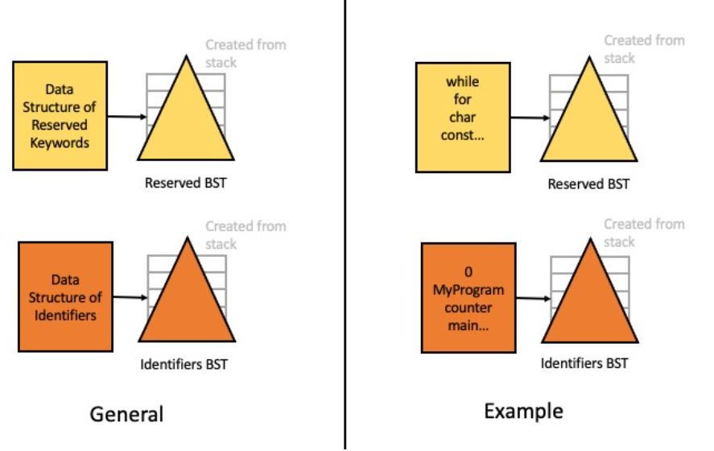

# Project 3: Java Language Parser
**Purpose:** To practice and demonstrate proficiency in creating, manipulating and utilizing Binary Search Trees.

**Skills Used:** Java programming

**Knowledge Goals:** Binary Search Trees, File IO

## Summary
For this project, you will be writing a simple Java language compiler. A compiler must examine tokens in a program and decide if they are reserved words or identifiers defined by the user. Do not include punctuation in identifiers defined by the user. You will be designing a program that will read a Java program file and make two binary search trees (BSTs). These BSTs will each be implemented how you choose and will be as balanced as possible. You will use a Sorted List (or data structure of your choice, yes, native Java data structures are okay such as ArrayList) to store the reserved keywords and then populate the first BST with the reserved keywords. The second BST will be populated with user-defined identifiers. Whenever you encounter a token, search the BST of reserved words and if its not a reserved word, search the BST of user-defined identifiers. If the token is not on either list, you should add it to the BST of user-defined identifiers.

You are permitted to implement this using Heaps rather than BSTs. Know that the structure of the classes will be different and it may require additional work. Only take on this alternate version if you are ready to put the extra time in.

## Tasks:
1. Ensure your Tree package classes and interfaces are in place and complete (same from class).
2. Create your Parser class.
3. Create your Main.

### Part 1: UML Class Diagram
Create a UML class diagram of the project. Because our projects are not large in scope, these UML diagrams will sometimes be pretty simple. Use any of the UML creators I offered as options on Canvas. Please submit the UML Class Diagram as either PDF or image file such as JPG, PNG, etc. Please use the tutorial given in the Prelude of the book as an example.

### Part 2: Java Implementation
Packages, Interfaces and Classes
* Tree
    * TreeInterface 
    * SearchTreeInterface 
    * BinaryTreeInterface
    * TreeIteratorInterface
    * BinaryTree
    * BinarySearchTree
    * BinaryNode
* JavaProgramToBeTested
    * This is the program you will end up parsing using the Parser class.
* Parser
* Main
    * Where you run the experiment.

You will need two additional files:
1. reservedWords.txt
2. Palindrome.java

The former is the reserved keywords you will check for. The latter is the Java program you will parse.

If you feel that other classes would benefit your project, you are free to add more. Feel free to go above and beyond and make this as interesting as possible.

The interface files should be the same as the one used in class.

### Methods for Binary Search Trees Implementations beyond whats in the implementation
Most of these should be in the code implemented in class.
* setTree
* getEntry
* findEntry
* contains
* add
* addEntry
* remove
* removeEntry
* removeFromRoot
* findLargest
* removeLargest
* private class ReturnObject

### Methods for Parser.java
* Constructor(s)
* initializeReservedWords
    * Read in the file of reserved words and put them into your reserved words data structure. Then use setBalancedBST to set up a balanced BST from them.
* setBalancedBST
    * Add a reserved word and ensure binary search tree is balanced.
* getIdentifiers
    * Finds the identifiers in a Java program and adds them to the identifiers BST.

### Layout

### Output
Your output should be relatively simple. You will simply print the list of reserved keywords found and then print the list of user-defined identifiers found. Be sure you are not including punctuation in the user identifiers produced. A good example of some user identifiers would be tacocat, A, 0... etc.

### Some other items of importance:
* Use javadoc comments on your functions to explain what they do. You do not have to do this in the class implementations where there is an interface, you can use @inheritDoc.
* Be sure your code is clean, legible and easy to read.
* Feel free to go above and beyond!  Add new methods and functionality, test in different ways in addition to what you are required to do, be creative! The top grades go to those who go above and beyond. Strive for excellence.
* You are not required to create unit tests but are welcome to do so if you wish.
* Including the runtime as a comment on algorithms with loops in them will be seen as going above and beyond as well.

## Format Requirements
Please ensure you follow the structure as listed above. Use IntelliJ to do your work. Use Javadoc comments where appropriate.
Ensure that your UML diagram submission is in PDF or an image file format.

## Assessment
Please see the Rubric attached for assessment.

## Deliverables
* Please add your UML documents to your Git repository. I will look for them there.
* Submit a link to your Git repository. Make sure to add me as a collaborator, so I can see your code.
* Each partner should submit a link. This is to ensure both partners don't forget to write a reflection of their partnership in Canvas.